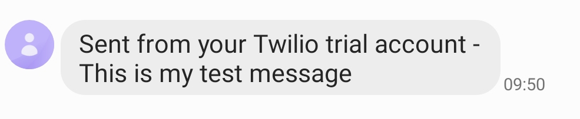

# Learning Doc


- [Learning Doc](#learning-doc)
- [Week 2](#week-2)
  - [July 6th, 2021](#july-6th-2021)
    - [Refactor Bob's Bagel Green](#refactor-bobs-bagel-green)
  - [July 7th, 2021](#july-7th-2021)
    - [Bob's Bagels Red](#bobs-bagels-red)
  - [July 8th 2021](#july-8th-2021)
    - [Coupling Part 2](#coupling-part-2)
  - [July 9th, 2021](#july-9th-2021)
    - [Twilio](#twilio)
- [Week 1](#week-1)
  - [July 2nd, 2021](#july-2nd-2021)
    - [Coupling](#coupling)
  - [July 4th, 2021](#july-4th-2021)
    - [Airport Challenge](#airport-challenge)

# Week 2
## July 6th, 2021 
### Refactor Bob's Bagel Green 

Refactored Bob's Bagel Green based on things noticed on the 6th


## July 7th, 2021 
### Bob's Bagels Red
Started work on Bob's Bagels Red edition. Managed to create a domain model. 


## July 8th 2021
### Coupling Part 2 
Did more work on coupling. 

This involved changing: 

```js
items = [
      new Item(1),
      new Item(2),
      new Item(3),
    ];
```


into:

```js
items = [
      {price: 1},
      {price: 2},
      {price: 2},
    ];
```
This is so that the testing in this class is not dependent on the item class. This means that if the item class changes or is broken, this does not affect the testing of this class. 

I also replaced this: 
```js
printReceipt () {
    const receipt = new Receipt(this.total()); 
    return receipt.print();
}
```

with this: 
```js
printReceipt (ReceiptPointer = Receipt) {
    const receipt = new ReceiptPointer(this.total());
    return receipt.print();
}
```
This is so that you can provide an alternative of the receipt class in the method, which means that the class has become more decoupled.  

## July 9th, 2021
### Twilio
I used the twilio service and npm library to send a text message to my phone. 

```js
client.messages
  .create({
     body: 'This is my test message',
     from: '**********',
     to: '**********'
   })
  .then(message => console.log(message.sid));
```


# Week 1
## July 2nd, 2021 
### Coupling 

Successfully completed task on Coupling. 
https://github.com/RyanVanDijck/Coupling


## July 4th, 2021 
### Airport Challenge 
Completed the airport challenge. This involved writing tests before hand and writing code against those tests. 

https://github.com/RyanVanDijck/airport-challenge
