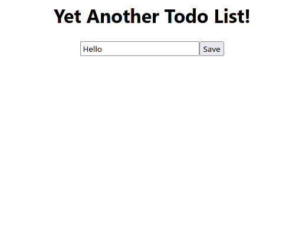
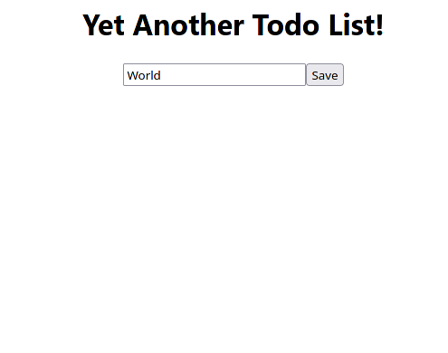
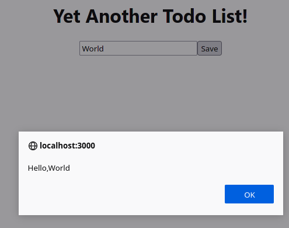

# Learning Doc

- [Learning Doc](#learning-doc)
- [Week 6](#week-6)
  - [August 2nd, 2021](#august-2nd-2021)
  - [Postgressql](#postgressql)
- [Week 5](#week-5)
  - [July 27th, 2021](#july-27th-2021)
    - [Http Request](#http-request)
  - [July 28th, 2021](#july-28th-2021)
    - [Battle](#battle)
  - [July 29th, 2021](#july-29th-2021)
    - [Battle Part 2](#battle-part-2)
  - [July 31st, 2021](#july-31st-2021)
    - [Birthday](#birthday)
- [Week 4](#week-4)
  - [July 19th, 2021](#july-19th-2021)
    - [React](#react)
      - [Cypress Test](#cypress-test)
      - [React Test](#react-test)
    - [To do list](#to-do-list)
  - [July 20th, 2021](#july-20th-2021)
    - [Chameleon](#chameleon)
    - [Todo list](#todo-list)
  - [July 21st, 2021](#july-21st-2021)
    - [Emotional intelligence](#emotional-intelligence)
    - [Learning doc feedback part 2](#learning-doc-feedback-part-2)
  - [July 22nd, 2021](#july-22nd-2021)
    - [React Api](#react-api)
  - [July 23rd, 2021](#july-23rd-2021)
    - [Word Game](#word-game)
- [Week 3](#week-3)
  - [July 12th, 2021](#july-12th-2021)
    - [Bank Challenge](#bank-challenge)
    - [Thermostat](#thermostat)
  - [July 13th, 2021](#july-13th-2021)
    - [Cypress](#cypress)
    - [Thermostat Visual](#thermostat-visual)
  - [July 14th, 2021](#july-14th-2021)
    - [JQuery](#jquery)
    - [Async Programming](#async-programming)
  - [July 15th, 2021](#july-15th-2021)
    - [Ajax](#ajax)
    - [Process observations](#process-observations)
- [Week 2](#week-2)
  - [July 6th, 2021](#july-6th-2021)
    - [Refactor Bob's Bagel Green](#refactor-bobs-bagel-green)
  - [July 7th, 2021](#july-7th-2021)
    - [Bob's Bagels Red](#bobs-bagels-red)
  - [July 8th 2021](#july-8th-2021)
    - [Coupling Part 2](#coupling-part-2)
  - [July 9th, 2021](#july-9th-2021)
    - [Twilio](#twilio)
- [Week 1](#week-1)
  - [July 2nd, 2021](#july-2nd-2021)
    - [Coupling](#coupling)
  - [July 4th, 2021](#july-4th-2021)
    - [Airport Challenge](#airport-challenge)

# Week 6
## August 2nd, 2021

## Postgressql

I was able to install and initialise postgress ony my machine. 


# Week 5

## July 27th, 2021

### Http Request
We drew a diagram to explain the process of an http transfer when you visit a website. 


## July 28th, 2021

### Battle 

Started work on a battle game, managed to display player names

## July 29th, 2021

### Battle Part 2
Added damage and paralysis to game. 

## July 31st, 2021

### Birthday
With a pair partner, I worked on a simple server based program that would check how far away your birthday is. 

# Week 4

## July 19th, 2021

### React
I started by creating my first app using the react framework. This was fairly simple and only involved creating a project and changing around some of the html elements.

```js
import './App.css';

function App() {
  return (
    <p id = "greeting">hello world</p>
  );
}

export default App;
```


This process involved writing cypress tests and react tests.

#### Cypress Test

```js
it('App test', () => {
    cy.visit('/');
    cy.get('#greeting').should("contain", "hello world");
})
```


#### React Test

```js
import { render, screen } from '@testing-library/react';
import App from './App';

test('renders learn react link', () => {
  render(<App />);
  const linkElement = screen.getByText(/Hello World/i);
  expect(linkElement).toBeInTheDocument();
});
```


### To do list
We need to create a to do list using React. 

Today we created a heading, input box, and button by test driving it in react and cypress. 


## July 20th, 2021 

### Chameleon 
I needed to create a react application that changed the colour of a heading when I clicked the coresponding button. 

```js 
import React, { Component } from 'react'

class ColourChange extends Component{
    constructor(props) {
        super(props)
        this.state = { Colour:''}
    }
    red = () => {
        this.setState({Colour: 'red'});
    }
    blue = () => {
        this.setState({Colour: 'blue'});
    }
    green = () => {
        this.setState({Colour: 'green'});
    }
    render(){
        return(
            <div>
                <h1 style={{color : this.state.Colour}}>I am a Chameleon</h1>
                <button onClick={this.red}>Red</button>
                <button onClick={this.blue}>Blue</button>
                <button onClick={this.green}>Green</button>
            </div>
        )
    }
}

export default ColourChange
```
https://user-images.githubusercontent.com/71043499/126317085-31245f93-09d6-44d5-945c-08965a536e09.mp4

### Todo list
We were able to store typed tasks in an array.

```js
input = (event) => {
  event.preventDefault()
  this.setState({text: event.target.value})
}
  
submit = (event) => {
  event.preventDefault()
  this.state.tasks.push(this.state.text)
  alert(this.state.tasks)
}
```





## July 21st, 2021

### Emotional intelligence
We had a talk about emotional intellgence. Having emotional intelligence essentially means that you are aware of your emotions, why you feel them and that you can deal with them in a constructive way. 

We also talked about reflection and how it is important to reflect on aspects of ourselves that we feel need
improvement, while also not allowing these measures to become obstrucive in our daily lives. 

### Learning doc feedback part 2 
Today I gave and recieved feedback about learning documentation. Based on the feedback, I have 
decided to include more reflection in these entries, rather than just details about what I achieved over the day. 

## July 22nd, 2021

### React Api

I was able to use React and JQuery to make a call to the github api. 

```js 
function getData() {
  $.get("https://api.github.com/users/RyanVanDijck"
  ).done((data) => {
   console.log(data.login)
  })
}
```

I am still stuggling with async programming and am still unsure about react. 

## July 23rd, 2021

### Word Game
On build day, I created a basic version of an hangman game using react. 


  
# Week 3

## July 12th, 2021

### Bank Challenge
I gave and recieved feedback for the bank challenge. I thought I did well overall, but others had interesting ideas on how to make the code neater and easier to read.

### Thermostat
We wrote a thermostat class in a pair. This involved in depth pair programming.
https://github.com/RyanVanDijck/Thermostat/commits/master

## July 13th, 2021

### Cypress
I started by learning the basics on how to write tests and run tests using the Cypress framework.

This framework allows you to write tests that look at the contents of a webpage.

I changed code to pass prewritten tests.

### Thermostat Visual
I was able to convert the thermostat class into a visual webpage.


https://user-images.githubusercontent.com/71043499/126236046-e864e9b9-82fc-4462-9838-9db3fde11aae.mp4
## July 14th, 2021

### JQuery

I was able to learn the basics of JQuery, and use it to simplify the source code of the thermostat.

```js
$( document ).ready(function() {
  const thermostat = new Thermostat();

  $("#power").text(thermostat.onPowerSaving());

  $( "#down" ).click(function( event ) {
    $( "#message" ).text(thermostat.down());
    $("#usage").text(thermostat.getUsage());
  });

  $("#button").click((event) => {
    $( "#message" ).text(thermostat.up());
    $("#usage").text(thermostat.getUsage());
  })
  $("#change").click((event) => {
    thermostat.changePowerSaving();
    $("#power").text(thermostat.onPowerSaving());

  })
  $("#reset").click((event) => {
    $("#message").text(thermostat.reset);
    $("#usage").text(thermostat.getUsage());
  })
});
```
### Async Programming

Afterwards, I completed work based on Async programming with a pair partner. The purpose of the exercise was to run code that involved functions that need to wait for something. We needed to predict in what order different lines of code would run.

```js
console.log(1)
$(document).click(function(clickEvent) {
    console.log(3)
    console.log("The click event:", clickEvent);
    console.log(4)
});
console.log(2)
```

```js
console.log(1)
setTimeout(function hiThere(){
    console.log("Hi there!");
  console.log(3)
  console.log(4)
  },0)
console.log(2);
```

## July 15th, 2021
### Ajax
We started by trying to add an api to the thermostat.

```js
function getTemp(){
  return $.get(`http://api.openweathermap.org/data/2.5/weather?q=London&appid=${appid}`, (response) => {
    console.log(response.main.temp);
    return (response.main.temp - 273.15).toFixed(0);
  });
}

$( document ).ready(function() {
  const temp = setTimeout(() => {
    return getTemp();
  }, 0);
```

This involved using a weather api to acces the current temperature. There was a minor error.

### Process observations
I needed to do a process observation today. It mainly went well, but I had some difficulties with eslint and vscode.

I could improve by thinking about and writing tests about the core functionality before thinking about the state of the program.

# Week 2
## July 6th, 2021
### Refactor Bob's Bagel Green

Refactored Bob's Bagel Green based on things noticed on the 6th


## July 7th, 2021
### Bob's Bagels Red
Started work on Bob's Bagels Red edition. Managed to create a domain model.
Object|Properties|Messages|Context|Output
---|---|---|---|---
Basket|max_capacity @Number|Order|Basket Not Full and Item exists|@Array[@String]
||basket @array[@String]||Basket is full|@Error[@String 'Basket is full']
||cost @Cost||Item not found|@String
||receipt @reciept|Remove|Exists In Basket|@Array[@String]
||||Does not exist in basket|@Error[@String "Was never in your basket."]
|Receipt|totalPrices @Number|quantity|Basket Object|@String
|||getPrice|Item and number of that Item given|@Number
Cost|total @Number|total|Basket Given|@String
|||howMany|Basket and item given|@Number

## July 8th 2021
### Coupling Part 2
Did more work on coupling.

This involved changing:

```js
items = [
      new Item(1),
      new Item(2),
      new Item(3),
    ];
```


into:

```js
items = [
      {price: 1},
      {price: 2},
      {price: 2},
    ];
```
This is so that the testing in this class is not dependent on the item class. This means that if the item class changes or is broken, this does not affect the testing of this class.

I also replaced this:
```js
printReceipt () {
    const receipt = new Receipt(this.total());
    return receipt.print();
}
```

with this:
```js
printReceipt (ReceiptPointer = Receipt) {
    const receipt = new ReceiptPointer(this.total());
    return receipt.print();
}
```
This is so that you can provide an alternative of the receipt class in the method, which means that the class has become more decoupled.  

## July 9th, 2021
### Twilio
I used the twilio service and npm library to send a text message to my phone.

```js
client.messages
  .create({
     body: 'This is my test message',
     from: '**********',
     to: '**********'
   })
  .then(message => console.log(message.sid));
```


# Week 1
## July 2nd, 2021
### Coupling

Successfully completed task on Coupling.
https://github.com/RyanVanDijck/Coupling


## July 4th, 2021
### Airport Challenge
Completed the airport challenge. This involved writing tests before hand and writing code against those tests.

https://github.com/RyanVanDijck/airport-challenge
